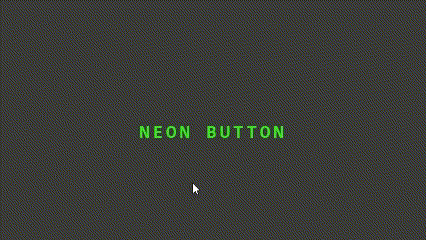

# HTML-CSS
## Программы
- **Visual Studio Code**
## Visual Studio Code

 
<i>Логотип Visual Studio Code</i>

  

Visual Studio Code - это мощный текстовый редактор, который может использоваться для создания и редактирования кода HTML и CSS. Он предоставляет множество полезных функций, таких как подсветка синтаксиса, автодополнение кода, проверка правописания, поддержка сниппетов, интеграция с системой контроля версий и многое другое. HTML (HyperText Markup Language) и CSS (Cascading Style Sheets) - это два языка программирования, используемых для создания и оформления веб-страниц. 

HTML - это язык разметки, который определяет структуру содержимого веб-страницы, такой как заголовки, абзацы, таблицы, изображения, ссылки и т.д. Он определяет, как элементы должны быть представлены в браузере.

CSS - это язык стилей, который определяет, как элементы, созданные с помощью HTML, должны быть оформлены. Он позволяет изменять цвет, шрифт, размер и расположение элементов на странице. 

Сочетание HTML и CSS позволяет создавать эстетичный и хорошо структурированный веб-сайт с легким и понятным кодом. Расмотрим примеры элементов, которыое могут сделать ваш сайт более эстетичным.

## Карточка

Для создания карточки, которая будет переворачиваться при наведении на нее, нужно использовать свойство transform и псевдокласс :hover.

 
<i>Пример работы карточки</i>

В этом примере мы создали общий блок для карточки с классом "card". Внутри этого блока мы создали два дочерних блока: "front" и "back". В свойствах этих блоков мы указали абсолютное позиционирование и стили для передней и задней сторон карточки. Затем мы использовали свойство "perspective", чтобы создать эффект перспективы при переворачивании. 

В блоке .card:hover мы указали свойство transform для каждой стороны карточки, которое переворачивает ее при наведении мыши.

Вы можете изменять размеры, цвета и другие стили, чтобы создавать карточки, соответствующие вашим потребностям.

## Неоновая кнопка

Для создания неоновой кнопки также надо использовать свойство transform и псевдокласс :hover.

 
<i>Пример работы неоновой кнопки</i>

  
  Опишем, как это работает:
1. Создаём тег `button` с классом `button` и текстом внутри.
2. Создаём теги `span` для каждой из четырёх линий.
3. Задаём свойства кнопке: позиционирование, цвет, размер шрифта, границы, отступы, шрифты, фон и т.д.
4. Задаём свойства линиям: позиционирование, размеры, форму, цвет.
5. Создаём эффект анимации при наведении (hover) на кнопку. При этом свойства изменяются для кнопки и для каждой линии.
  
## Теоретичский материал

Карточка-https://youtu.be/Kdal-3AfeRc

Неоновая кнопка-https://youtu.be/__rxApMI_Us

## Контакты
* VK: <a href="https://vk.com/ismail2003">Алиев Исмаил</a>
* Почта: aliev.ismail.2003@gmail.com
