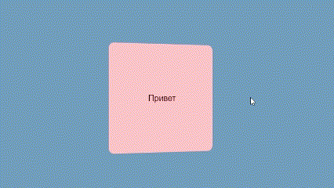

# HTML-CSS
## Программы
- **Visual Studio Code**
## Visual Studio Code

 
<i>Логотип Visual Studio Code</i>

  

Visual Studio Code - это мощный текстовый редактор, который может использоваться для создания и редактирования кода HTML и CSS. Он предоставляет множество полезных функций, таких как подсветка синтаксиса, автодополнение кода, проверка правописания, поддержка сниппетов, интеграция с системой контроля версий и многое другое. HTML (HyperText Markup Language) и CSS (Cascading Style Sheets) - это два языка программирования, используемых для создания и оформления веб-страниц. 

HTML - это язык разметки, который определяет структуру содержимого веб-страницы, такой как заголовки, абзацы, таблицы, изображения, ссылки и т.д. Он определяет, как элементы должны быть представлены в браузере.

CSS - это язык стилей, который определяет, как элементы, созданные с помощью HTML, должны быть оформлены. Он позволяет изменять цвет, шрифт, размер и расположение элементов на странице. 

Сочетание HTML и CSS позволяет создавать эстетичный и хорошо структурированный веб-сайт с легким и понятным кодом. Расмотрим примеры элементов, которыое могут сделать ваш сайт более эстетичным.

## Создание карточки

Для создания карточки, которая будет переворачиваться при наведении на нее, нужно использовать свойство transform и псевдокласс :hover. Для этого нужно следовать следующей структуре:

 
<i>Пример работы карточки</i>

В этом примере мы создали общий блок для карточки с классом "card". Внутри этого блока мы создали два дочерних блока: "front" и "back". В свойствах этих блоков мы указали абсолютное позиционирование и стили для передней и задней сторон карточки. Затем мы использовали свойство "perspective", чтобы создать эффект перспективы при переворачивании. 

В блоке .card:hover мы указали свойство transform для каждой стороны карточки, которое переворачивает ее при наведении мыши.

Вы можете изменять размеры, цвета и другие стили, чтобы создавать карточки, соответствующие вашим потребностям.

## Создание кнопки

С помощью строкового контейнера  мы создадим неоновые линии вокруг кнопки. Класс **а** задает размеры нашей кнопки, **a:hover** - при наведении мышки накладывает тени и меняет цвет надписи. Теперь для  указываем его разположение и анимацию.

 
<i>Пример работы кнопки</i>

  
## Вывод

Таким образом, Visual Studio Code является мощным инструментом для работы с HTML и CSS, который значительно упрощает и ускоряет процесс разработки веб-страниц.

## Контакты
* VK: <a href="https://vk.com/ismail2003">Алиев Исмаил</a>
* Почта: aliev.ismail.2003@gmail.com
